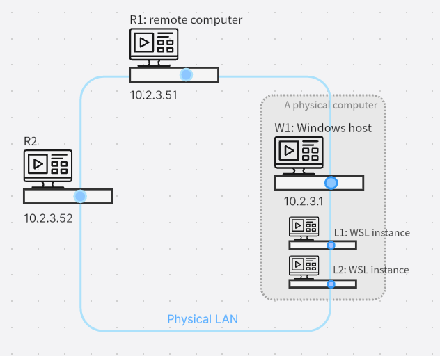
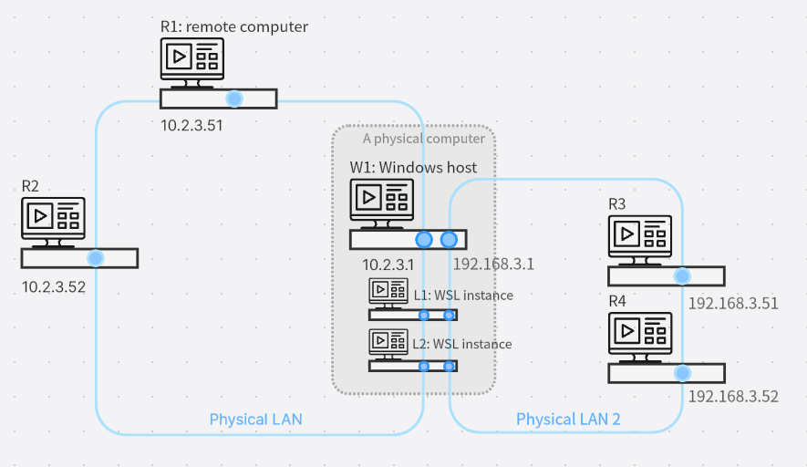
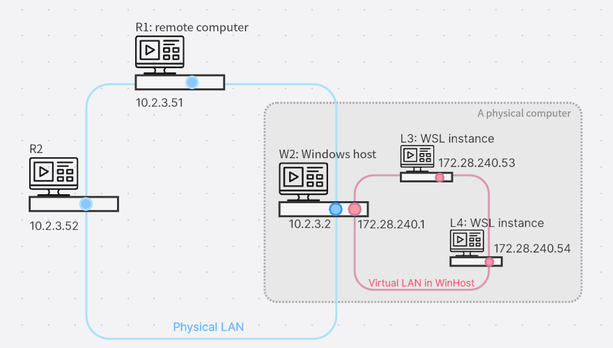

# WSL networking behavior and configuration

## The big picture

A running WSL instance is like a virtual machine(VM) running inside a Windows machine. Let's consider this Windows machine(abbreviated as WinHost in this article) a real-world physical machine who resides in a physical network(or say, physical LAN). So the PCs/Servers running on the physical network appear to WSL instances as "outside world".

There are substantially three roles in this WSL world: WinHost, WSL VMs, and outside world machines. Then what's the networking software behavior among these three roles? That is not a question which can be answered in one simple sentence. We need some elaboration here.

A WSL instance can operate in three flavors, and there are two WSL networking mode involved. 

| WSL flavor          | WSL1 | WSL2 in NAT mode    | WSL2 in mirrored mode |
| --------            | ---- | ------------------- | -------------------------|
| Networking behavior of a WSL instance | Shares WinHost's IP address(es). <br><br> Looks like it has network cable directly attached to the physical LAN. | Attached to an internal virtual LAN inside WinHost. <br><br> Has a dynamically allocated internal IP, which is different than WinHost's own IP. | Behaves the same as WSL1. |

So we call the two modes "mirrored mode" and "NAT mode". Illustration helps highlight there difference.

### WSL instances running in mirrored mode

Figure 1: A WinHost running two WSL instances in mirrored mode, with one NIC(network interface card).



Figure 2: A WinHost running two WSL instances in mirrored mode, with two NICs:



Key characteristics: In mirrored mode, a WSL instance, although as a self-contained VM, does not have its own dedicated IP address. Windows WSL engine magically shares physical NIC's IP address(es) among all mirrored-mode-enabled WSL VMs.
- If WinHost has one physical NIC configured with IP 10.2.3.1, then the WSL instance accordingly sees itself equipped with an NIC having IP 10.2.3.1 .
- If WinHost has two physical NICs with IP 10.2.3.1 and 192.168.3.1 respectively, then the WSL instance also sees two NICs with IP 10.2.3.1 and 192.168.3.1 respectively.


### WSL instances running in NAT mode


Figure 3: A WinHost running two WSL instances both in NAT mode




We see that:
 
- WinHost is equipped with one physical NIC (blue) connecting to all machines on the physical LAN.
- WinHost is also equipped with one virtual NIC(pink) connecting to all running WSL instances.


Each WSL instance(actually a Hyper-V virtual machine) has its own virtual NIC and its own IP address in the virtual LAN. This IP address(172.28.240.53 for example) is automatically allocated by WSL engine.

Key characteristics: The physical LAN(10.2.X.X) and the virtual LAN(172.28.X.X) are two different LAN segments, so IP packets are not directly reachable from each other. The Windows operating system provides some facilities to make them finally reachable. 
- **From WSL instance to outside world:** WSL engine's NAT code is always ready, so that the WSL instance(172.28.240.53 for example) can connect to a outside world TCP/UDP port(10.2.3.51's TCP port 80 for example) without extra work from the application code. A little drawback is that, the server side machine(10.2.3.51) only see the TCP/UDP connection is from WinHost's IP, which is due to NAT(Network Address Translation) protocol's working nature.
- **From outside world to WSL instance:** The whole virtual LAN is actually hidden from the outside world, so, if the client PC 10.2.3.52 wants to connect to a network server program inside WSL2 VM, WinHost has to relay that connection. This relay action is not the default behavior of the Windows OS, so user has to configure it manually. This is described in later section **"NAT mode: WSL as server, physical LAN machines as client"**.


## How to determine current networking mode for a WSL instance?

First, you should determine whether a WSL instance is running as WSL1 or WSL2. 

If it is WSL1, that instance is using mirrored mode.

Second, for those WSL2 instances, they either all run in NAT mode, or all run in mirrored mode, no mixing allowed.

On WinHost, the command `wsl -l -v` shows WSL operating version(WSL1 or WSL2), on the right-most `VERSION` column, for each instance. Output is something like this:

```
  NAME                   STATE           VERSION
  Ubuntu-22.04           Stopped         1
* WSL2-Ubuntu-24.04      Stopped         2
  WSL1-Ubuntu-20.04      Stopped         1
  openSUSE-Leap-15.6     Stopped         2
  docker-desktop         Stopped         2
  docker-desktop-data    Stopped         2
```

For a WSL2 instance, you run query command `wslinfo --networking-mode` inside that Linux instance. There can be three results:
- It prints `nat`, then it is in NAT mode.
- It prints `mirrored`, then it is in mirrored mode.
- It blames `wslinfo` command not found, or some other wacky output info, that means your WinHost's WSL software is now new enough to support mirrored mode. 

### How to enable WSL2 mirrored mode?

WSL2 mirrored mode is a relatively new feature which requires at least Windows 11 22H2, and, `wsl --update` should be run to update WSL engine to the latest version.

Besides, you should enable WSL mode explicitly, by editing `%UserProfile%\.wslconfig`. Add an extra line to `[wsl2]` section, like this:

```
[wsl2]
networkingMode=mirrored
```

More about [`.wslconfig` file](./wsl-config.md#configuration-settings-for-wslconfig).


## WSL Networking behavior

This section is all about two questions: 
1. If I run a network server program on WinHost, how can it be reachable by a client program from a WSL instance?
2. If I run a network server program inside a WSL instance, how can it be reachable by a client program from WinHost, or even from outside world(physical LAN client)?

### Mirrored mode 

Mirrored mode is straightforward with least hassle, so we talk about it first.

From TCP/IP networking perspective, a server or client program running in a WSL instance is just like running with WinHost's own IP address(es), so every machine on the LAN is directly reachable by the WSL instance, and vice versa.

For example with Figure 2 above, a server program in L1 WSL instance has two IPs(10.2.3.1 and 192.168.3.1), so
- R2(10.2.3.52) can connect to L1 via destination IP 10.2.3.1 , and 
- R4(192.168.3.52) can connect to L1 via destination IP 192.168.3.1 .

—no IP routing or NAT procedure involved, very straightforward.

Of course, L1's client program can connect to L2's server program via destination IP 127.0.0.1 . 


### NAT mode: WinHost as server, WSL as client

The key point here is: WSL client program needs to know WinHost's IP address on virtual LAN segment.

Take Figure 3 above for example, WinHost runs a server program and L3 (172.28.240.53) wants to connect, then L3 has to take 172.28.240.1 as server's IP address. 

Then how does L3 know that exact server IP address? That IP changes each time after WinHost reboots, so it cannot be a constant pre-configured for L3. The canonical way provided by Microsoft is, executing this command inside WSL: 

ip route show | grep -i default | awk '{ print $3}' 

In our example, the output will be a IP string `172.28.240.1` .

The rationale is: A NAT mode WSL instance will always have WinHost's virtual LAN IP(172.28.240.1 in this example) as default gateway. And, `ip route show` will output something like:

```
default via 172.28.240.1 dev eth0 proto kernel
172.28.240.0/20 dev eth0 proto kernel scope link src 172.28.240.53
```

The "default" line, column 3, shows the default gateway IP, so it is the right server IP we need.

> [!NOTE] The WinHost server program should listen on IP address `0.0.0.0` (instead of `127.0.0.1` or `localhost`) in order to accept connection from WSL, because in the eye of WinHost, WSL instance L1 and LAN client R1 are both considered remote clients.


### NAT mode: WSL as server, WinHost as client

From Figure 3 above, we see that WSL instance L3 has IP 172.28.240.53 .

A WinHost client program can reach a WSL server program(L3 for example), by assigning 172.28.240.53 as destination IP, which is no surprise.

But, WSL engine provides a facility feature for this scenario. If a WSL server program listens on TCP port N, then, WinHost client program can connect to `localhost` port N to reach it. 

For example, L3 has a TCP server program listening on `0.0.0.0:4000` or even on `localhost:4000`, then, WinHost can connect to `localhost:4000` to reach the server. This "proxy listening port" feature makes it as if the WSL server program is listening on WinHost itself.

> [!NOTE] The "proxy listening port" feature works only for TCP, not for UDP. (Microsoft staff please confirm this.)


### NAT mode: WSL as server, physical LAN machines as client

The challenge here is, a WSL instance's IP address is hidden from physical LAN, so WinHost has to do port-forwarding so that the WSL's IP address can be indirectly reachable from the outside world.

Here's an example of using the [Netsh interface portproxy](/windows-server/networking/technologies/netsh/netsh-interface-portproxy) Windows command to add a port proxy that listens on your host port and forward the connection request to the IP address and port for the WSL2 VM.

```
netsh interface portproxy add v4tov4 listenport=14000 listenaddress=0.0.0.0 connectport=4000 connectaddress=172.28.240.53
```

In the above example, we tell WinHost to listen on port 14000 and accept connections from any remote machine. Once connected, the connection is redirected to 172.28.240.53:4000 . So, a server program running inside L3 listening on port 4000 can now actually accept connection from any remote machine.

In normal case, we assign the same value for `listenport` and `connectport`, but to demonstrate the concept clearly, we use different values in this example.


**Here we have an important point to mention.** A WSL instance gets its IP address differently across each WinHost reboot(WSL engine allocates the IP dynamically). If the system administrator of WinHost determines to write a startup script (e.g. `wsl-portforward.bat`) to apply the above `netsh interface portproxy ...` command, then how does he determine the `connectaddress`'s value?

OK. There is a way. We can use a WinHost command to query L1's IP address as long as we know L1's "WSL name"(we have called it "distribution name" or "instance name").

To list all WSL names on WinHost, we execute `wsl -l` . The output is like this:

```
Windows Subsystem for Linux Distributions:
Ubuntu-22.04 (Default)
Ubuntu-24.04
```

Different WSL names identify different WSL instances registered on this WinHost. A WSL name is determined upon its registration on the system and it will not change across WinHost's reboot. 

Assume that WinHost's script needs to query Ubuntu-22.04's current IP address, it should launch the following command and grab its STDOUT output:

```cmd
wsl.exe -d Ubuntu-22.04 hostname -I
```

That output string is the IP address of the very WSL instance.

Under the hood, that command launches WSL instance named `Ubuntu-22.04` right away, and tells the instance to execute command `hostname -I` (which prints WSL instance's own IP to STDOUT) then the STDOUT text content is relayed back to wsl.exe, and wsl.exe finally prints that out to command-line terminal.

Now, our WinHost script can uses this IP string as `connectaddress`'s value. Problem solved.

A concrete example of wsl-portforward.bat :

```cmd
@echo off

set vmip=vimp_null
FOR /F %%i IN ('wsl.exe -d Ubuntu-22.04 hostname -I') DO set vmip=%%i

REM === TODO: some text error checking for vmip. ===

netsh interface portproxy add v4tov4 listenport=14000 listenaddress=0.0.0.0 connectport=4000 connectaddress=%vmip%

REM === This netsh does not set ERRORLEVEL on error, if given wrong parameter. Beg your own fortune. ===
```


## More about WSL2 mirrored mode networking

Compared to WSL2 NAT mode, here are the current benefits to enabling this mode:

- IPv6 support
- Connect to WinHost server programs from within WSL instance using localhost address `127.0.0.1`. But, IPv6 localhost address `::1` is not supported.
- Improved networking compatibility for VPNs
- Multicast support
- Connect to WSL directly from your local area network (LAN)


Be aware, WSL2 mirrored mode does not exempt WSL2 server programs from WinHost's firewall rule. That means, for a WSL program to serve on TCP port 80, WinHost administrator has to [configure Hyper-V firewall](/windows/security/operating-system-security/network-security/windows-firewall/hyper-v-firewall) to allow this inbound connection, using command:

```powershell
Set-NetFirewallHyperVVMSetting -Name '{40E0AC32-46A5-438A-A0B2-2B479E8F2E90}' -DefaultInboundAction Allow
```

or

```powershell
New-NetFirewallHyperVRule -Name "MyWebServer" -DisplayName "My Web Server" -Direction Inbound -VMCreatorId '{40E0AC32-46A5-438A-A0B2-2B479E8F2E90}' -Protocol TCP -LocalPorts 80
```

This new mirrored mode addresses networking issues seen with earlier NAT mode. Find known issues or file feedback on any bugs identified in the [WSL product repo on GitHub](https://github.com/microsoft/wsl).


## DNS Tunneling

On machines running Windows 11 22H2 and higher, setting [`dnsTunneling=true` under `[wsl2]` in the `.wslconfig` file](./wsl-config.md#configuration-settings-for-wslconfig) has WSL use a virtualization feature to answer DNS requests from within WSL, instead of requesting them over a networking packet. This feature is aimed to improve compatibility with VPNs, and other complex networking set ups.

## Auto Proxy

On machines running Windows 11 22H2 and higher, setting [`autoProxy=true` under `[wsl2]` in the `.wslconfig` file](./wsl-config.md#configuration-settings-for-wslconfig) enforces WSL to use Windows' HTTP proxy information. If you have a proxy already set up in Windows, enabling this feature will make that proxy be set automatically in WSL as well.

## WSL and firewall

On machines running Windows 11 22H2 and higher, with WSL 2.0.9 and higher, the Hyper-V firewall feature will be turned on by default. This will ensure that: 

- See [Windows Defender Firewall with Advanced Security](/windows/security/operating-system-security/network-security/windows-firewall/windows-firewall-with-advanced-security) to learn more about Windows security features that will automatically apply to WSL.
- See [Configure Hyper-V firewall](/windows/security/operating-system-security/network-security/windows-firewall/hyper-v-firewall) to learn more about applying these rules and settings both locally and via online tools like Intune. 
